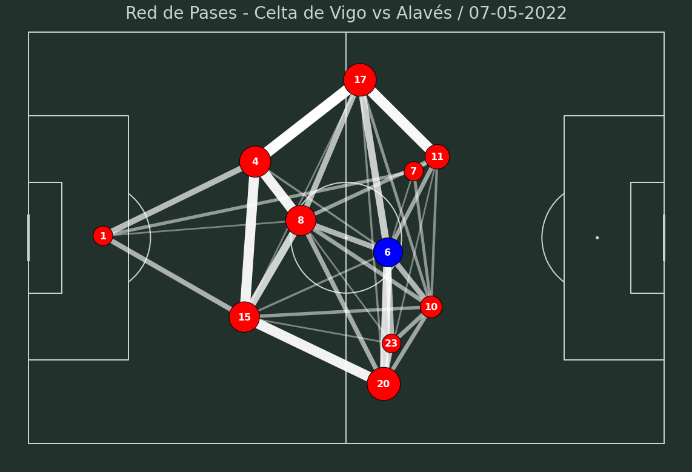
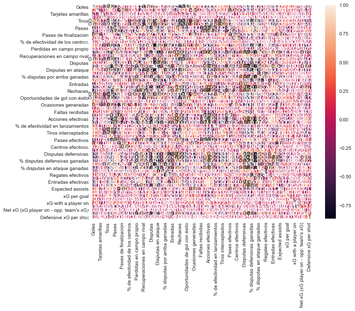
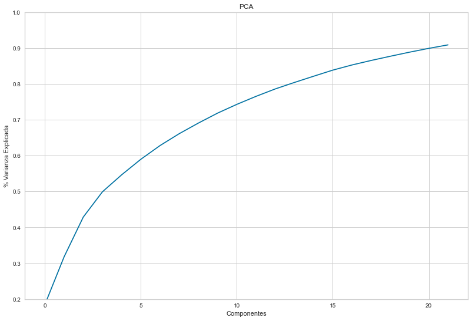
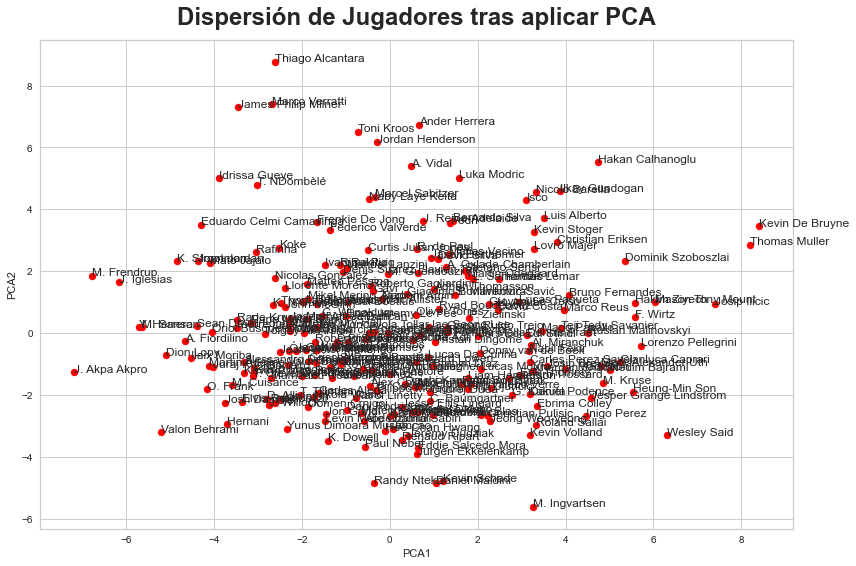
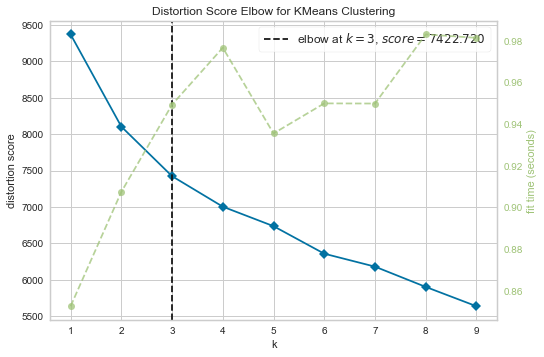
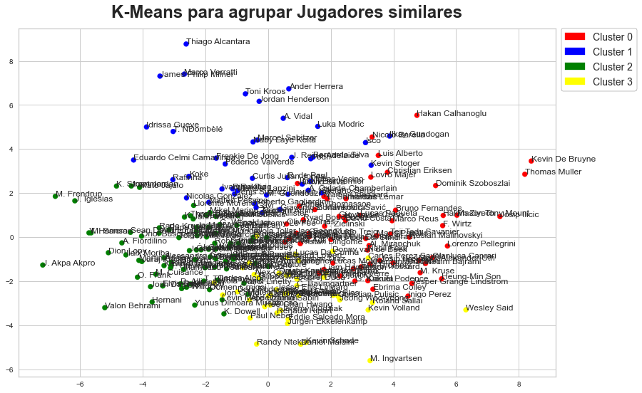

## Celta de Vigo 2022 - The Playmaker Dilemma. A Data-Driven Approach


We will establish that we work as data analysts in the recruitment area of Celta de Vigo.

The Galician team was, at the time the summer market closed, in the process of finding a way out for what has been the main playmaker of the team in recent years, Denis Suárez, mainly due to disagreements with the current board.

We will carry out the task of looking for a profile that could fit into the role of organizer that Denis Suarez, out of the club plans due to disagreements with the board, has been assuming in recent years, mainly since the arrival of Argentine Eduardo Coudet on the bench. The goal of this project will be, then, to obtain a shortlist of similar players to Denis Suárez, employing techniques such as clustering and having in account the concept of euclidean distance.

In order to get the project done, we will employ aggregated data regarding the top 5 European Leagues for players and squads, provided by **Instat**.

Let's proceed to import the necessary packages.

```python
import pandas as pd
import matplotlib.pyplot as plt
import matplotlib.style as style
import numpy as np
import seaborn as sns

from sklearn.cluster import KMeans
from sklearn import preprocessing
from sklearn.decomposition import PCA

import matplotlib.patches as mpatches
from matplotlib.colors import ListedColormap
from mplsoccer.pitch import Pitch
import xml.etree.ElementTree as et
from matplotlib.colors import to_rgba
import glob
from scipy.spatial import distance
from yellowbrick.cluster.elbow import kelbow_visualizer
```


In order to contextualize the analysis that is to be conducted, we will try, first of all, to clarify and explain the role on which we will work and its context.


```python
file = './Partidos/07-05-2022--Spain--Primera-DivisionCelta-de-Vigo-4-0-Alaves20220815-66695-imnyxl.xml'
descanso = 45*60
fecha = file.split('/')[2]
fecha = fecha.split('--')[0]
fecha
tree = et.parse(file)
root = tree.getroot()

node_names = ['ID', 'start', 'end', 'code', 'pos_x', 'pos_y']
node_names_full = []
matrix = []
for node in root.iter('ALL_INSTANCES'):
    for instance in node.iter('instance'):
        if instance.find('code').text!='Empezar marca de tiempo':
            row=[]
            for node_name in node_names:
                row.append(instance.find(node_name).text)
            for label in instance.iter('label'):
                row.append(label.find('text').text)
                if label.find('group').text not in node_names_full and label.find('group').text not in node_names:
                    node_names_full.append(label.find('group').text)
            matrix.append(row)
```


```python
df = pd.DataFrame(data = matrix,columns = node_names+node_names_full)
df.rename({'code':'Player','Medio':'Half'},axis=1,inplace=True)
for i in ['ID','start','end','pos_x','pos_y']:
    df[i] = pd.to_numeric(df[i])
    
tit = list(df[(df['Half'].str.contains('1')) & (df.Equipo.str.contains('Celta'))]['Player'].unique())
df_pases = df[(df['Accion']=='Pases precisos') & (df.Equipo.str.contains('Celta'))]
df['Rec_x'] = 0
df['Rec_y'] = 0
df['Rec_Jugador'] = ''
df['Rec_Outcome'] = ''

for i,j in df_pases.iterrows():
    player = df_pases.loc[i,'Player']
    team = df_pases.loc[i,'Equipo']
    if j['Accion'] == 'Pases precisos':
        for k,h in df[i:].iterrows():
            if player!=h['Player'] and team==h['Equipo']:
                df_pases.loc[i,'Rec_x']= df.loc[k,'pos_x']
                df_pases.loc[i,'Rec_y']= df.loc[k,'pos_y']
                df_pases.loc[i,'Rec_Jugador']= df.loc[k,'Player']
                if team==h['Equipo']:
                    df_pases.loc[i,'Rec_Outcome']= 'Propio'
                else:
                    df_pases.loc[i,'Rec_Outcome']= 'Rival'
                break
df_pos= df_pases.groupby('Player').agg({'pos_x':['mean'],'pos_y':['mean'],'Player':['count']})
df_pos.columns = ['_'.join(col) for col in df_pos.columns.values if col!='Player']
df_pos = df_pos.reset_index()
df_pos = df_pos[df_pos.Player.isin(tit)]

df_rec= df_pases.groupby('Rec_Jugador').agg({'Rec_x':['mean'],'Rec_y':['mean'],'Player':['count']})
df_rec.columns = ['_'.join(col) for col in df_rec.columns.values]
df_rec = df_rec.reset_index()

df_rel = df_pases.groupby(by=['Player','Rec_Jugador'],as_index=False)['Accion'].count()
df_rel.rename({'Accion':'count'},axis=1,inplace=True)
df_rel['Flag'] = 0
df_aux = df_rel

matrix = []

for i,j in df_rel.iterrows():
    for k,h in df_aux.iterrows():
        if df_rel.loc[i,'Flag']==0:
            matrix.append([j['Player'],j['Rec_Jugador'],j['count']])
            df_rel.loc[i,'Flag']=1
        elif (j['Player']==h['Rec_Jugador']) and (j['Rec_Jugador']==h['Player']) and (df_rel.loc[k,'Flag']==0):
            matrix.append([h['Rec_Jugador'],h['Player'],h['count']])
            df_rel.loc[k,'Flag']=1
            
df_rel = pd.DataFrame(data=matrix,columns=['Player','Rec_Jugador','count'])
df_rel = df_rel.groupby(by=['Player','Rec_Jugador'],as_index=False)['count'].sum()
df_rel.rename({'count':'sum'},axis=1,inplace=True)

df_merged = pd.merge(df_rel,df_pos,how='left',on='Player')
df_merged.columns = ['Passer','Receiver','Passes','passer_x','passer_y','count_passer']
df_merged = pd.merge(df_merged,df_pos,how='left',left_on='Receiver',right_on='Player')

df_merged.drop('Player',axis=1,inplace=True)
df_merged.rename({'pos_x_mean':'receiver_x','pos_y_mean':'receiver_y','Player_count':'count_receiver'},
                inplace=True,axis=1)
df_merged.head()

max_line_width = 18
max_marker_size = 3000
df_merged['width'] = df_merged.Passes / df_merged.Passes.max() * max_line_width
df_pos['marker_size'] = (df_pos['Player_count']
                                         / df_pos['Player_count'].max() * max_marker_size)
```


```python
df_merged = df_merged[df_merged['Passes']>3]
```

```python
min_transparency = 0.3
color = np.array(to_rgba('white'))
color = np.tile(color, (df_merged.shape[0], 1))
c_transparency = df_merged.Passes / df_merged.Passes.max()
c_transparency = (c_transparency * (1 - min_transparency)) + min_transparency
color[:, 3] = c_transparency

pitch = Pitch(pitch_type='uefa',
              pitch_color='#22312b', line_color='#c7d5cc')
fig, ax = pitch.draw(figsize=(16, 11))
pass_lines = pitch.lines(df_merged.passer_x, df_merged.passer_y,
                         df_merged.receiver_x, df_merged.receiver_y, lw=df_merged.width,
                         color=color, zorder=1, ax=ax)
df_pos2 = df_pos[df_pos['Player'].str.contains('Denis')] 
df_pos1 = df_pos[~df_pos.isin(list(df_pos2.Player))]
pass_nodes = pitch.scatter(df_pos1.pos_x_mean, df_pos1.pos_y_mean, s=df_pos1.marker_size,
                           color='red', edgecolors='black', linewidth=1, alpha=1, ax=ax)
pass_nodes = pitch.scatter(df_pos2.pos_x_mean, df_pos2.pos_y_mean, s=df_pos2.marker_size,
                           color='blue', edgecolors='black', linewidth=1, alpha=1, ax=ax)
for i, j in df_pos.iterrows():
    dorsal = j['Player'].split('.')
    d = dorsal[0]
    pitch.annotate(d, xy=(j['pos_x_mean'], j['pos_y_mean']), c='white', va='center', ha='center', size=16, weight='bold', ax=ax)
title = ax.set_title("Red de Pases - {} vs {} / {}".format(df_pases.Equipo.head(1).values[0], 'Alavés',fecha), size=28, y=0.97, color='#c7d5cc')
fig.set_facecolor("#22312b")
```


    

    


We see that Denis Suárez (6) assumes a key role in the particular system of Eduardo Coudet. In a system in which the sides are exclusively for the full-backs, who are always open (and therefore take up so much of the ball), the wings of the rhombus constantly seek depth, with little intervention from them in support.

The buildup is divided between the two central pieces of the rhombus, although each one has a different function. The apex, in this case former Rayo player Fran Beltrán, takes the responsibility of from the back, positioning himself between central defenders and allowing the full-backs to go depth. At this stage, Denis usually stays higher up the pitch, having the effective responsibility of orchestrating the attacks and connecting with the team's key player in attack, Iago Aspas, or with the full-backs, who usually wait for the ball high up. If the team gets stuck in the first stage of the buildup, Denis usually goes down and falls to a band to facilitate the pass to the center back on that side. Therefore, although looking exclusively at the plot it may seem that Coudet has a rhombus, the role of the "6" is far from being that of a midfielder. Similarly, the role of the wings -Brais Méndez and Franco Cervi- is far from being that of a typical central midfielder of a 4-3-3, being infrequent that they assume a role of support when the ball is in possession out of the final third.


```python

def elbow_method(X, max_range_for_elbow):
    return kelbow_visualizer(KMeans(random_state=0), X, k=(1, max_range_for_elbow)) 

dfs=[]
for i in glob.glob('./datos_instat_jugadores/*.xlsx'):
    k = i.split('.')
    k= k[-2]
    k = k.replace('PrimeraDivision','LaLiga')
    if '2022' in i:
        data = pd.read_excel(i)
        data['Comp'] = k
        dfs.append(data)
        
df = pd.concat(dfs)
df.rename({'Unnamed: 0':'Num','Unnamed: 1':'Jugador'},axis=1,inplace=True)
```

```python
df.drop('Num',inplace=True,axis=1)
num_cols = ['Partidos jugados','Minutos jugados','Starting lineup appearances', 'Jugador sustituido',
       'De sustitucion', 'Goles', 'Asistencias', 'Fueras de juego',
       'Tarjetas amarillas', 'Tarjetas rojas', 'Tiros', 'Tiros a portería',
       'Penalti', 'Penaltis marcados', '% de penaltis marcados', 'Pases',
       '% de efectividad de pases', 'Pases de finalización', 'Centros',
       '% de efectividad de los centros', 'Balones perdidos',
       'Pérdidas en campo propio', 'Balones recuperados',
       'Recuperaciones en campo rival', 'Goles esperados', 'Disputas',
       '% disputas ganadas', 'Disputas en ataque', 'Disputas aéreas',
       '% disputas por arriba ganadas', 'Regates', 'Entradas',
       'Interceptaciones', 'Rechaces', 'Jugadas de gol',
       'Oportunidades de gol con éxito', 'Ocasiones de gol, % conversión',
       'Ocasiones generadas', 'Faltas', 'Faltas recibidas', 'Acciones totales',
       'Acciones efectivas', '% acciones efectivas',
       '% de efectividad en lanzamientos', 'Tiros fuera',
       'Tiros interceptados', 'Tiros en el poste / palo', 'Pases efectivos',
       'Pases de finalización efectivos', 'Centros efectivos',
       'Disputas ganadas', 'Disputas defensivas',
       'Disputas defensivas ganadas', '% disputas defensivas ganadas',
       'Disputas en ataque ganadas', '% disputas en ataque ganadas',
       'Disputas por arriba ganadas', 'Regates efectivos',
       'Regates con éxito, %', 'Entradas efectivas',
       'Robos de balón con éxito, %', 'Expected assists', 'xG per shot',
       'xG per goal', 'xG conversion', 'xG with a player on',
       "Opponent's xG with a player on",
       "Net xG (xG player on - opp. team's xG)",
       'Defensive xG (xG of shots made by guarded player)',
       'Defensive xG per shot']

rel_cols = ['Goles', 'Asistencias',
       'Tarjetas amarillas', 'Tarjetas rojas', 'Tiros', 'Tiros a portería', 'Pases',
       '% de efectividad de pases', 'Pases de finalización', 'Centros',
       '% de efectividad de los centros', 'Balones perdidos',
       'Pérdidas en campo propio', 'Balones recuperados',
       'Recuperaciones en campo rival', 'Goles esperados', 'Disputas',
       '% disputas ganadas', 'Disputas en ataque', 'Disputas aéreas',
       '% disputas por arriba ganadas', 'Regates', 'Entradas',
       'Interceptaciones', 'Rechaces', 'Jugadas de gol',
       'Oportunidades de gol con éxito', 'Ocasiones de gol, % conversión',
       'Ocasiones generadas', 'Faltas', 'Faltas recibidas', 'Acciones totales',
       'Acciones efectivas', '% acciones efectivas',
       '% de efectividad en lanzamientos', 'Tiros fuera',
       'Tiros interceptados', 'Tiros en el poste / palo', 'Pases efectivos',
       'Pases de finalización efectivos', 'Centros efectivos',
       'Disputas ganadas', 'Disputas defensivas',
       'Disputas defensivas ganadas', '% disputas defensivas ganadas',
       'Disputas en ataque ganadas', '% disputas en ataque ganadas',
       'Disputas por arriba ganadas', 'Regates efectivos',
       'Regates con éxito, %', 'Entradas efectivas',
       'Robos de balón con éxito, %', 'Expected assists', 'xG per shot',
       'xG per goal', 'xG conversion', 'xG with a player on',
       "Opponent's xG with a player on",
       "Net xG (xG player on - opp. team's xG)",
       'Defensive xG (xG of shots made by guarded player)',
       'Defensive xG per shot']
```


```python
for i in df.columns:
    if i in num_cols:
        df[i]=df[i].astype(str)
        df[i]=df[i].str.replace('-','0')
        df[i]=df[i].str.replace('%','')
        df[i] = pd.to_numeric(df[i])
    else:
        df[i]=df[i].astype(str)
```


```python
df_filt = df[(df['Partidos jugados']>=8) & (df['Starting lineup appearances']>=0.1)]
df_filt.shape[0]
```

```python
df_filt = df_filt.sort_values(by='Partidos jugados',ascending=False)
df_filt = df_filt.drop_duplicates(subset='Jugador',keep='first')
df_filt = df_filt.set_index('Jugador')
```

We consider that there are two categorical variables that, when referring to players, are of key importance in the analysis of similarities between them. On the one hand, the good leg can be decisive when it comes to offering more accurate results, so we will use OneHotEncoder to convert it into a numeric variable that can be accepted by the clustering algorithm.

On the other hand, with the same objective of improving the accuracy of the model, we will proceed to carry out the analysis segregating by positions. We will carry out a small cleaning of the variable unifying the two winger positions, since in current football most footballers who play in that position are perfectly capable of playing on both wings.


```python
encoder = preprocessing.OneHotEncoder(sparse=False)
codif = encoder.fit_transform(df_filt[['Pierna']])
df_filt[encoder.get_feature_names()] = codif
df_filt['Pierna_Buena'] = df_filt['x0_Derechа']
for i in df_filt.columns:
    if 'x0' in i:
        df_filt.drop(i,inplace=True,axis=1)

df_filt['Posición'] = np.where(df_filt['Posición'].str.startswith('E'),'EXT',df_filt['Posición'])
```
    EXT    409
    DC     400
    MCD    355
    D      322
    MC     229
    LD     157
    LI     142


```python
correlation_matrix = df_filt[rel_cols].corr()
plt.figure(figsize=(10,8))
sns.heatmap(correlation_matrix, annot = True)
plt.show()
```


    

    


Due to business logic, we consider that, despite the fact that we are segmenting by positions, an amount less than the four clusters is small and oversimplifies the model. On the other hand, we do not want it to lose efficiency in favor of precision, so the maximum number of clusters that we will process will be 6.

To find the similarities we will base ourselves on the Euclidean distance, instead of opting for the correlation coefficient.


```python
def player_similarities(player):
    pos = df_filt[df_filt.index==player]['Posición'].values[0]
    print('Buscando jugadores similares a {}'.format(player).upper())
    print('Starting model for {}'.format(pos))
    scaler = preprocessing.StandardScaler()
    norm = scaler.fit_transform(df_filt[rel_cols])
    df_norm = pd.DataFrame(norm,index=df_filt.index,columns=rel_cols)
    df_norm = pd.merge(df_norm,df_filt[['Posición']],how='left',left_index=True,right_index=True)
    df_norm = df_norm[df_norm['Posición']==pos]
    df_norm.drop('Posición',axis=1,inplace=True)
    pca_model = PCA(n_components=0.9, svd_solver='full')
    matrix_pca = pca_model.fit_transform(df_norm)
    df_pca = pd.DataFrame(matrix_pca, index=df_norm.index)
    df_pca.head(10)
    print('PCA - {} Components'.format(len(pca.components_[0])))
    var = pca_model.explained_variance_ratio_.cumsum()
    print('Variance Explained by the model: ',var[-1])
    
    # Plot: PCA
    plt.figure(figsize=(13.5, 9))
    plt.ylabel('% Varianza Explicada')
    plt.xlabel('Componentes')
    plt.title('PCA')
    plt.ylim(0.2,1)
    plt.plot(var)
    plt.show()
    
    # PLot: Dispersión
    plt.figure(figsize=(13.5, 9))
    ax = plt.axes()
    plt.xlabel('PCA1')
    plt.ylabel('PCA2')
    plt.scatter(df_pca[0], df_pca[1], c='red', s=50)
    plt.title('Dispersión de Jugadores tras aplicar PCA', fontsize=24, fontweight="bold", pad=15)

    for team in df_pca.index:
        plt.text(df_pca[0][team], df_pca[1][team], team)

    plt.show()
    
    # Plot: elbow
    view = elbow_method(df_pca,10)
    
    if view.elbow_value_>6:
        n = 6
    elif view.elbow_value_<4:
        n=4
    else:
        n = view.elbow_value_
    
    print('Aplicando KMeans para {} clusters'.format(n))
    kmeans_model = KMeans(n, random_state = 1)
    kmeans_var = kmeans_model.fit_predict(df_pca)

    df_pca['cluster'] = kmeans_model.labels_
    
    # Plot: Dispersión con Clusters
    labels = kmeans_model.labels_
    patches = []
    colors_array = ['red','blue','green', 'yellow']
    colors = ListedColormap(colors_array)
    plt.figure(figsize=(13.5, 9))
    plt.scatter(x=df_pca[0], y=df_pca[1], c=labels, cmap=colors, s=50)

    plt.title('K-Means para agrupar Jugadores similares', fontsize=24, fontweight="bold", pad=15)

    for team in df_pca.index:
        plt.text(df_pca[0][team], df_pca[1][team], team)

    for i in range(n):
        patches.append(mpatches.Patch(color=colors_array[i], label= "Cluster " + str(i)))

    plt.legend(handles=patches,bbox_to_anchor=(1.01, 1), loc=2, frameon=True, edgecolor='black', prop={'size': 14}, borderaxespad=0.)

    plt.show()
    
    y = df_pca[df_pca.index==player]
    print('Cluster of {}: {}'.format(player,y['cluster'].values[0]))
    euc = []
    for i in df_pca.values:
        euc.append(distance.euclidean(y.values,i))
    simil = pd.DataFrame(euc,index=df_pca.index,columns=['Similarity_Score'])
    simil = simil.sort_values(by='Similarity_Score',ascending=True)[1:]
    simil = pd.merge(simil,df_pca[['cluster']],how='left',left_index=True,right_index=True)
    
    return simil
```


```python
jug='Denis Suarez'
k= player_similarities(jug)
```

    BUSCANDO JUGADORES SIMILARES A DENIS SUAREZ
    Starting model for MC
    PCA - 23 Components
    Variance Explained by the model:  0.9084837905094296
    


    

    


    

    


    

    


    Aplicando KMeans para 4 clusters
    


    

    


    Cluster of Denis Suarez: 1
    


```python
print('Top25 similar players to {}'.format(jug))
k.head(25)
```

**Top25 similar players to Denis Suarez**

|               Player | Similarity_Score | Cluster |
|---------------------:|-----------------:|---------|
|        Oliver Torres |         3.934338 |       0 |
|       Manuel Lanzini |         3.955426 |       1 |
|         Ivan Rakitic |         4.034623 |       1 |
|    Jean-Paul Boetius |         4.159477 |       2 |
|   Enzo Jeremy Le Fee |         4.173170 |       2 |
|         M. Guendouzi |         4.179340 |       1 |
|           R. de Paul |         4.330125 |       1 |
|    Thomas Monconduit |         4.357219 |       2 |
|     K. Dewsbury-Hall |         4.385391 |       2 |
|     Jason Berthomier |         4.535688 |       0 |
|  Pablo Fornals Malla |         4.622609 |       0 |
| Jacob Matthew Ramsey |         4.667034 |       2 |
|       Ryad Boudebouz |         4.695615 |       0 |
|         Flavien Tait |         4.703122 |       1 |
|      Roberto Soriano |         4.762920 |       2 |
|                 Koke |         4.925307 |       1 |
|        J. Bellegarde |         4.945791 |       2 |
|       Mathias Jensen |         5.024261 |       2 |
|          Yacine Adli |         5.025038 |       0 |
| Joseph Alfred Duncan |         5.034981 |       2 |
|    Tolgay Ali Arslan |         5.061588 |       2 |
|          Joan Jordan |         5.070861 |       2 |
|         K. N'Guessan |         5.126637 |       2 |
|     Adrien Thomasson |         5.135279 |       0 |
|         P. Zielinski |         5.232612 |       0 |


As stated in the table above, West Ham United playmaker Manuel Lanzini is the player who, sharing the same cluster, shows more similarity to Denis Suárez, while Sevilla midfielder Oliver Torres gets the closest score in overall terms.


This summer Celta has assumed the signing of Óscar Rodríguez. He has an undisputed capacity of being decisive from a role in midfield -particularly due to his excellent ball striking-, but he has never excelled in organizational tasks. This fact becomes even more relevant in the case of Celta, since Coudet system encourages the footballer who occupies the central position in the trident positioned behind the two forwards to be the one who practically assumes alone the elaboration of the game. Without being the same position and staying slightly more advanced, when Celta attacks in positional play and is established in the opposing field,  it looks pretty similar to the role of Jorginho at Chelsea.

Eduardo Coudet has chosen Óscar in the first games of the season in the position previously occupied by Denis, preferring the former Real Madrid player over the talented academy midfield Gabri Veiga or the ambivalent Luca de la Torre. We will see below the similarity between Denis Suárez's style based on data from last season and the player from Talavera, in order to be able to assess Óscar's suitability for this particular and unique role.


```python
k['Rank'] = k['Similarity_Score'].rank()
k['Rank'] = k['Rank'].astype(int)
k_sel = k[(k.index.isin(list(cen_celta.index)))]
```


```python
print('Numero de mcs analizados: ',k.shape[0])
k_sel['Rank']
```

    Numero de mcs analizados:  228
                         Rank
    Oscar Rodriguez       101
    Carles Perez Sayol    214
    Name: Rank, dtype: int32


```python
jug='Oscar Rodriguez'
k= player_similarities(jug)
```
    


    Cluster of Oscar Rodriguez: 2
    


**Top25 Similar Players to Oscar Rodriguez**

| Player               | Similarity_Score | Cluster |
|----------------------|------------------|---------|
| Daichi Kamada        | 4.291656         | 3       |
| Davide Frattesi      | 4.496194         | 2       |
| Lucas Da Cunha       | 4.626503         | 3       |
| Carles Alena         | 4.735966         | 2       |
| Ondrej Duda          | 4.857688         | 3       |
| Pablo Martínez       | 4.903607         | 2       |
| Angelo Fulgini       | 4.921506         | 3       |
| Razvan Gabriel Marin | 5.018147         | 2       |
| Dani Rodriguez       | 5.134989         | 3       |
| Takefusa Kubo        | 5.249071         | 3       |
| Jeffrey Schlupp      | 5.319064         | 2       |
| Jon Moncayola Tollar | 5.337213         | 2       |
| Darko Brasanac       | 5.379556         | 2       |
| Renaud Ripart        | 5.415441         | 3       |
| L. Blas              | 5.439190         | 3       |
| Brahim Diaz          | 5.465729         | 3       |
| Elvis Rexhbecaj      | 5.500173         | 2       |
| Alexis Mac Allister  | 5.530057         | 2       |
| Genki Haraguchi      | 5.569957         | 2       |
| W. McKennie          | 5.594515         | 2       |
| K. N'Guessan         | 5.603062         | 2       |
| Tolgay Ali Arslan    | 5.603895         | 2       |
| K. Dewsbury-Hall     | 5.638321         | 2       |
| Trincao              | 5.664128         | 3       |
| Leandro Trossard     | 5.680188         | 0       |

According to our analysis, there are exactly 100 footballers in the five major European leagues that are more suitable than Óscar to fit the role that once belonged to Denis. The former Leganés midfielder is between the 25th and 50th percentile, and slightly below the average. In addition, he belongs to cluster 2, while Denis is in 1, just as the likes of Koke, Matteo Guendouzi, Ivan Rakitic or Flavian Tait, midfielders who are characterized by assuming a large amount of pass volume.

In fact, we observe that, when obtaining the players who are the most similar to Óscar, there are profiles clearly linked to the midfielder or winger position (Trincao, Trossard, Schlupp, Brahim, Kamada or McAllister) and box-to-box/all-round midfielders (Moncayola, McKennie, Brasanac). In short, players who assume a role that is far from organizational in their teams and whose role in buildup of the game is much more linked to progression through carries and the direct creation of opportunities through key passes or charges to the box from backwards.

If it depended on the team of analysts, the club would be recommended to go to the market (or resort to Veiga or De la Torre) to carry out the aforementioned tactical function, assigning Óscar to one of the two positions on the wings, where he would assume a volume of Inferior game under construction but would have the ability to step on more area and also drive and generate better situations to exploit his excellent right foot.

For more details see [GitHub Repo](https://github.com/alexfrf/curso-afecfa).
