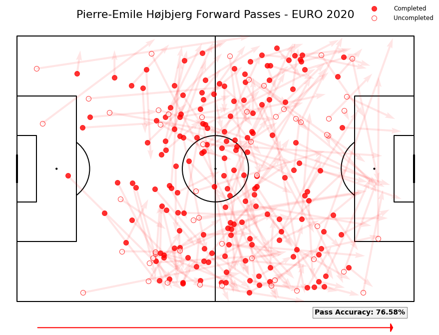

## Pierre-Emile Højbjerg on Euro 2020 - Analysis based on Data

*This paper served as an assignment that was part of the practical content of the excellent [Soccermatics](https://soccermatics.readthedocs.io/en/latest/index.html) course, created by David Sumpter.*


Pierre-Emile Hojbjerg emerged as a leader of the Danish National team throughout their brilliant run at the Euro 2020, where the Scandinavian squad was able to reach the semifinals and even to force England to defeat them in the extra time for a spot in the Final.

In this piece, we will carry out an analysis based on event data -provided by Statsbomb- regarding the performance given by the Spurs player during the tournament. We will employ Python in order to handling the data and creating the visualizations that we may need. Let's start importing the needed packages at first.


```python
import pandas as pd
import numpy as np
from mplsoccer import Pitch,Sbopen,VerticalPitch
import matplotlib.pyplot as plt
import glob
import seaborn as sns

team = 'Denmark'
player = 'Pierre-Emile Højbjerg'
```


```python
parser = Sbopen()
df = parser.match(competition_id = 55,season_id = 43)
matches = df[( df['home_team_name'].str.contains('Denmark') ) | ( df['away_team_name'].str.contains('Denmark') )]['match_id'].to_list()
no_games = len(matches)
print('Number of Games: ',no_games)
```

    Number of Games:  6
    


```python
ph = parser.event(matches[0])[0]
ph = ph[ph['team_name'].str.contains(team)] # Retrieving just the players from Denmark
ph.player_name.unique()
```


    array([nan, 'Andreas Christensen', 'Daniel Wass', 'Simon Thorup Kjær',
           'Jannik Vestergaard', 'Martin Braithwaite Christensen',
           'Kasper Schmeichel', 'Joakim Mæhle', 'Pierre-Emile Højbjerg',
           'Yussuf Yurary Poulsen', 'Mikkel Damsgaard', 'Thomas Delaney',
           'Kasper Dolberg', 'Jens Stryger Larsen', 'Christian Nørgaard',
           'Andreas Evald Cornelius', 'Mathias Jensen'], dtype=object)


```python
tactics = parser.event(3795109)[-1]
starters = list(tactics.player_name[:22])
df_passes = df[(df['type_name']=='Pass') & (df['team_name'].str.contains(team)) & (df.outcome_name.isnull()) & (df.sub_type_name != "Throw-in")]
df_passes = df_passes[(df_passes['player_name'].isin(starters)) & (df_passes['pass_recipient_name'].isin(starters))]
df_passes['player_fname'] = df_passes['player_name'].apply(lambda x: str(x).split()[0])
df_passes['player_name'] = df_passes.apply(lambda x: x['player_name'].replace(x['player_fname'],''), axis=1).str.strip()
df_passes['player_name'] = df_passes['player_name'].apply(lambda x: str(x).split()[0])
df_passes['pass_recipient_fname'] = df_passes['pass_recipient_name'].apply(lambda x: str(x).split()[0])
df_passes['pass_recipient_name'] = df_passes.apply(lambda x: x['pass_recipient_name'].replace(x['pass_recipient_fname'],''), axis=1).str.strip()
df_passes['pass_recipient_name'] = df_passes['pass_recipient_name'].apply(lambda x: str(x).split()[0])
df_passes.player_name.unique()
```


    array(['Højbjerg', 'Schmeichel', 'Christensen', 'Thorup', 'Delaney',
           'Mæhle', 'Vestergaard', 'Stryger', 'Dolberg', 'Damsgaard',
           'Braithwaite'], dtype=object)


```python
scatter_df = pd.DataFrame()
for i, name in enumerate(df_passes["player_name"].unique()):
    x = df_passes[df_passes["player_name"] == name]["x"].values
    recx = df_passes[df_passes["pass_recipient_name"] == name]["end_x"].values
    y = df_passes[df_passes["player_name"] == name]["y"].values
    recy = df_passes[df_passes["pass_recipient_name"] == name]["end_y"].values
    scatter_df.loc[i, "player_name"] = name
    #make sure that x and y location for each circle representing the player is the average of passes and receptions
    scatter_df.loc[i, "x"] = round(np.mean(np.concatenate([x, recx])),2)
    scatter_df.loc[i, "y"] = round(np.mean(np.concatenate([y, recy])),2)
    #calculate number of passes
    scatter_df.loc[i,"no"] = int(df_passes[df_passes["player_name"] == name].count().values[0])

scatter_df
```

| player_name |     x |     y |   no |
|------------:|------:|------:|-----:|
|    Højbjerg | 61.02 | 48.60 | 35.0 |
|  Schmeichel | 11.34 | 40.24 | 19.0 |
| Christensen | 46.81 | 60.98 | 27.0 |
|      Thorup | 40.72 | 43.97 | 13.0 |
|     Delaney | 57.99 | 35.73 | 20.0 |
|       Mæhle | 55.72 |  8.97 | 20.0 |
| Vestergaard | 46.71 | 23.57 | 20.0 |
|     Stryger | 66.27 | 72.26 | 25.0 |
|     Dolberg | 75.61 | 48.93 | 15.0 |
|   Damsgaard | 68.74 | 48.83 | 17.0 |
| Braithwaite | 73.53 | 43.89 | 21.0 |

```python
#adjust the size of a circle so that the player who made more passes
scatter_df['marker_size'] = (scatter_df['no'] / scatter_df['no'].max() * 1500)
```


```python
#counting passes between players
df_passes["pair_key"] =  df_passes['player_name'] + '_' + df_passes.pass_recipient_name
lines_df = df_passes.groupby(["pair_key"]).x.count().reset_index()
lines_df.rename({'x':'count'}, axis='columns', inplace=True)
#setting a treshold. You can try to investigate how it changes when you change it.
lines_df = lines_df[lines_df['count']>2]
lines_df['player_name']= lines_df.pair_key.apply(lambda x: str(x).split('_')[0])
lines_df['pass_recipient_name']= lines_df.pair_key.apply(lambda x: str(x).split('_')[1])
lines_df = lines_df.sort_values('count',ascending=False)
lines_df[lines_df.pair_key.str.contains(player.split(' ')[-1])]
```

|             pair_key | count | player_name | pass_recipient_name |
|---------------------:|------:|------------:|--------------------:|
|     Højbjerg_Stryger |     7 |    Højbjerg |             Stryger |
| Braithwaite_Højbjerg |     6 | Braithwaite |            Højbjerg |
| Højbjerg_Vestergaard |     6 |    Højbjerg |         Vestergaard |
| Christensen_Højbjerg |     5 | Christensen |            Højbjerg |
|       Mæhle_Højbjerg |     4 |       Mæhle |            Højbjerg |
|     Stryger_Højbjerg |     4 |     Stryger |            Højbjerg |
|      Højbjerg_Thorup |     4 |    Højbjerg |              Thorup |
|       Højbjerg_Mæhle |     4 |    Højbjerg |               Mæhle |
| Højbjerg_Christensen |     4 |    Højbjerg |         Christensen |
|   Højbjerg_Damsgaard |     3 |    Højbjerg |           Damsgaard |
| Højbjerg_Braithwaite |     3 |    Højbjerg |         Braithwaite |


```python
pitch = Pitch(line_color='grey')
fig, ax = pitch.grid(grid_height=0.9, title_height=0.06, axis=False,
                     endnote_height=0.04, title_space=0, endnote_space=0)
# Plotting nodes

pitch.scatter(scatter_df.x, scatter_df.y,
              s=scatter_df.marker_size,
              color='red', edgecolors='black', linewidth=1, alpha=0.5, ax=ax["pitch"], zorder = 3)

for i, j in scatter_df.iterrows():
    if j.player_name=='Damsgaard':
        pitch.annotate(j.player_name, xy=(77, 57), c='black', va='center', ha='center',weight = "bold",
                       size=14, ax=ax["pitch"], zorder = 4)
        pitch.arrows(j.x, j.y,77,55, width=1,
            color='black',alpha=1,ax=ax['pitch'])
    elif j.player_name in player:
        pitch.annotate(j.player_name.upper(), xy=(j.x, j.y), c='black', va='center', ha='center', weight = "bold",
                       size=14, ax=ax["pitch"], zorder = 4,color='blue')
    else:
        pitch.annotate(j.player_name, xy=(j.x, j.y), c='black', va='center', ha='center',weight = "bold",
                       size=14, ax=ax["pitch"], zorder = 4)
    
# Plotting lines

for i,j in lines_df.iterrows():
    player1 = j['player_name']
    player2 = j['pass_recipient_name']
    
    player1_x = scatter_df[scatter_df.player_name==player1]['x'].values[0]
    player2_x = scatter_df[scatter_df.player_name==player2]['x'].values[0]
    player1_y = scatter_df[scatter_df.player_name==player1]['y'].values[0]
    player2_y = scatter_df[scatter_df.player_name==player2]['y'].values[0]
    
    line_width = (j['count'] / lines_df['count'].max() * 10)
    
    pitch.lines(player1_x,player1_y,player2_x,player2_y,alpha=0.6,
                   lw=line_width, zorder=2, color="red", ax = ax["pitch"])
fig.suptitle('{} Passing Network vs. Czech Republic - EURO 2020'.format(team),fontsize=18)
plt.show();
```


    

    


Kasper Hjulmand designed a precise and effective system based on rapid transitions in buildup, with highly paced possessions and wide fullbacks, positioned high on the pitch and constantly looking for deep vertical runs. The Spurs’ midfielder played a key role in this system, taking on the task of receiving from the centre-backs and then connecting with the inspired playmaker Mikkel Damsgaard as well as switching balls to the opposite full-back, Joakim Maehle. 


```python
#find one who made most passes
max_no = lines_df["count"].max() 
#calculate the denominator - 10*the total sum of passes
denominator = 10*lines_df["count"].sum() 
#calculate the nominator
nominator = (max_no - lines_df["count"]).sum()
#calculate the centralisation index
centralisation_index = nominator/denominator
print("Centralisation index is ", centralisation_index)
```

    Centralisation index is  0.07083333333333333
    


```python
df_passes = pd.DataFrame()

for i in matches:
    df = parser.event(i)[0]
    df = df[(df.type_name == "Pass")  & (df.sub_type_name.isnull()) & (df.outcome_name.isnull()) & (df.player_name==player)]
    df_passes = pd.concat([df_passes, df])
```


```python
pitch = VerticalPitch(line_color='black', pad_top=20)
fig, axs = pitch.grid(ncols = 3, nrows = 2, grid_height=0.85, title_height=0.01, axis=False,
                     endnote_height=0.04, title_space=0.04, endnote_space=0.01)

list_ = ['Martin Braithwaite Christensen','Mikkel Damsgaard','Kasper Dolberg',
         'Joakim Mæhle','Thomas Delaney','Jens Stryger Larsen']
df_passes = df_passes[df_passes['pass_recipient_name'].isin(list_)]
#for each player
for name, ax in zip(list_, axs['pitch'].flat[:len(list_)]):
    #put player name over the plot
    ax.text(39, -10, name,
            ha='center', va='center', fontsize=14)
    #take only passes by this player
    player_df = df_passes.loc[df_passes["pass_recipient_name"] == name]
    #scatter
    #pitch.scatter(player_df.x, player_df.y, alpha = 0.8, s = 50, color = "re", ax=ax)
    #plot arrow
    pitch.arrows(player_df.x, player_df.y,
            player_df.end_x, player_df.end_y, color = "darkred", ax=ax, width=1.25)
    
    
#Another way to set title using mplsoccer 
axs['title'].text(0.5, 0.5, '{} - Passes per Receptor\nEURO 2020'.format(player), ha='center', va='center', fontsize=20)
plt.show()
```


    

    


As a result of the fact commented above, the Tottenham midfielder stands out -by far- as the Danish player who attempted more passes and defensive actions per game, establishing himself as the core of the Scandinavian squad. 


```python
passes = pd.DataFrame()
def_actions = pd.DataFrame()

for i in matches:
    game = parser.event(i)[0]
    rival = list(game[~game.team_name.str.contains(team)].team_name.unique())[0]
    game['Rival'] = rival
    passes_match = game[(game.type_name == "Pass")  & (game.sub_type_name.isnull()) & (game.team_name=='Denmark')]
    defa = game[(game.team_name=='Denmark') & ((game['type_name']=='Pressure') | (game['type_name']=='Ball Recovery') | (game['type_name']=='Block') | (game['type_name']=='Interception') | (game['type_name']=='Clearance'))]
    passes = pd.concat([passes, passes_match])
    def_actions = pd.concat([def_actions,defa])
    
print('{} - passes per game: {:.2f}'.format(player,passes[passes.player_name==player].shape[0]/no_games))
```

    Pierre-Emile Højbjerg - passes per game: 58.67
    


```python
gr = passes.groupby('player_name').x.count()
gr = gr/no_games
gr = gr.sort_values(ascending=False)
plt.figure(figsize=(5,6))
gr.plot.barh(color='red')
plt.xlabel('Passes per Game',size=12,weight='bold')
sns.despine()
```


    

    


```python
gr = def_actions.groupby('player_name').x.count()
gr = gr/no_games
gr = gr.sort_values(ascending=False)

plt.figure(figsize=(5,6))
gr.plot.barh(color='red')
plt.xlabel('Defensive Actions per Game',size=12,weight='bold')
sns.despine()
```


    

    


The diagrams coming next show us the volume of passes carried out by Hojbjerg during the whole tournament. It is worth to highlight the width disposition of the Danish player’s interventions. Hojbjerg does not only appear in the central part of the pitch, as a classic deep lying midfielder of a possession-based team, he also goes wide to get the ball and spread the opposing midfield. As a result, he covers a large area also in buildup, allowing fullbacks to stay forward and helping the talented Damsgaard to have a less crowded opposition in the middle, what would favour more and better situations of chances created by a through-ball or a wise carry by the Brentford playmaker. 


```python
passes = passes[passes.player_name==player]
pitch = Pitch(line_zorder=2, line_color='black')
fig, ax = pitch.grid(grid_height=0.9, title_height=0.06, axis=False,
                     endnote_height=0.04, title_space=0, endnote_space=0)
#get the 2D histogram 
bin_statistic = pitch.bin_statistic(passes.x, passes.y, statistic='count', bins=(6, 5), normalize=False)
#normalize by number of games
bin_statistic["statistic"] = bin_statistic["statistic"]/no_games
#make a heatmap
pcm  = pitch.heatmap(bin_statistic, cmap='Reds', edgecolor='grey', ax=ax['pitch'])
plt.annotate('', xy=(0.95, -0.01), xycoords='axes fraction', xytext=(0.05, -0.01), 
            arrowprops=dict(arrowstyle='-|>, head_width=0.75', color='red',lw=2))
#legend to our plot
ax_cbar = fig.add_axes((1, 0.093, 0.03, 0.786))
cbar = plt.colorbar(pcm, cax=ax_cbar)
fig.suptitle('Passes by ' + player + " per game" + " - EURO 2020", fontsize = 25)
plt.show()
```


    

    


```python
passes = passes[passes.outcome_name.isnull()]
pitch = Pitch(line_zorder=2,line_color='black')
fig, ax = pitch.grid(grid_height=0.9, title_height=0.06, axis=False,
                     endnote_height=0.04, title_space=0, endnote_space=0)

bin_statistic = pitch.bin_statistic(passes.x, passes.y, statistic='count', bins=(8, 5), normalize=False)
bin_statistic["statistic"] = bin_statistic["statistic"]/no_games

grid= pd.DataFrame(bin_statistic["binnumber"],columns=passes.index,index=['xmean','ymean']).T
bin_passes = pd.merge(passes,grid,how='left',left_index=True,right_index=True)
bin_passes['bin'] = bin_passes['xmean'].astype(str) + bin_passes['ymean'].astype(str)
bin_passes = bin_passes.groupby('bin')[['x','y','end_x','end_y']].mean()

pcm  = pitch.heatmap(bin_statistic, cmap='Reds', edgecolor='grey', ax=ax['pitch'])
plt.annotate('', xy=(0.95, -0.01), xycoords='axes fraction', xytext=(0.05, -0.01), 
            arrowprops=dict(arrowstyle='-|>, head_width=0.75', color='red',lw=2))
ax_cbar = fig.add_axes((1, 0.093, 0.03, 0.786))
cbar = plt.colorbar(pcm, cax=ax_cbar)

pitch.arrows(bin_passes.x, bin_passes.y,bin_passes.end_x,bin_passes.end_y,width=1.5,
            color='blue',alpha=1,ax=ax['pitch'])

fig.suptitle('Pass Volume & Average Pass per Game and Quadrant\n {} - EURO 2020'.format(passes['player_name'].unique()[0]), fontsize = 20)
plt.show()
```


    

    


```python
forward = passes[passes['end_x']>=passes['x']]
pitch = Pitch(line_color='black')
fig, ax = pitch.grid(grid_height=0.9, title_height=0.06, axis=False,
                     endnote_height=0.04, title_space=0, endnote_space=0)

right = forward[forward.outcome_name.isnull()]
err = forward[~forward.outcome_name.isnull()]
accuracy = 100*right.shape[0]/forward.shape[0]
pitch.scatter(right.x,right.y,s=100,color='red',edgecolors='red',linewidth=1, alpha=0.8, ax=ax["pitch"],label='Completed')

pitch.scatter(err.x,err.y,s=100,color='white',edgecolors='red',linewidth=1, alpha=0.8, ax=ax["pitch"],label='Uncompleted')
pitch.arrows(forward.x, forward.y,forward.end_x,forward.end_y,
            color='red',alpha=0.1,ax=ax['pitch'])
plt.annotate("Pass Accuracy: {:.2f}%".format(accuracy),xy=(0.75,1), fontsize=14, weight='bold',
             bbox={'facecolor': '.9', 'edgecolor':'black', 'boxstyle':'square', 'alpha' : 0.5})
plt.annotate('', xy=(0.95, -0.01), xycoords='axes fraction', xytext=(0.05, -0.01), 
            arrowprops=dict(arrowstyle='-|>, head_width=0.75', color='red',lw=2))
fig.suptitle('{} Forward Passes - EURO 2020'.format(player),fontsize=22)
fig.legend( handlelength=5, edgecolor='None', fontsize=12, loc='upper right')
plt.show();
```


    

    


```python
final_3rd = df.end_x.max()/3 * 2
final_3rd

incursions = pd.DataFrame()

for i in matches:
    df = parser.event(i)[0]
    df = df[["type_name","x", "y", "end_x", "end_y", "minute", "second", "player_name",'team_name','outcome_name','sub_type_name']]
    rival = list(df[~df.team_name.str.contains(team)].team_name.unique())[0]
    df['Rival'] = rival
    inc = df[(df['player_name']==player) & ((df['type_name']=='Carry') | (df['type_name']=='Pass')) & (df.sub_type_name.isnull()) & (df.outcome_name.isnull())]
    inc = inc[(inc['end_x']>=final_3rd) & (inc['x']<=final_3rd)]
    incursions = pd.concat([incursions,inc])
    
incursions.shape[0]
```


    53


```python
pitch = Pitch(line_zorder=2, line_color='black')
fig, ax = pitch.grid(grid_height=0.9, title_height=0.06, axis=False,
                     endnote_height=0.04, title_space=0, endnote_space=0)

passes = incursions[incursions.type_name=='Pass']
carries = incursions[incursions.type_name!='Pass']
bin_statistic = pitch.bin_statistic(carries.end_x, carries.end_y, statistic='count', bins=(3,1), normalize=False)
pcm  = pitch.heatmap(bin_statistic, cmap='Purples', edgecolor='black', ax=ax['pitch'],alpha=0.25)
pitch.scatter(passes.x,passes.y,s=150,color='red',edgecolors='black',linewidth=1, alpha=0.8, ax=ax["pitch"],label='Pass')
pitch.scatter(carries.x,carries.y,s=150,color='blue',edgecolors='black',linewidth=1, alpha=0.8, ax=ax["pitch"],label='Carry')
pitch.arrows(passes.x, passes.y,passes.end_x,passes.end_y,
            color='red',alpha=0.5,ax=ax['pitch'])
pitch.arrows(carries.x, carries.y,carries.end_x,carries.end_y,
            color='blue',alpha=0.5,ax=ax['pitch'])

plt.annotate('', xy=(0.95, -0.01), xycoords='axes fraction', xytext=(0.05, -0.01), 
            arrowprops=dict(arrowstyle='-|>, head_width=0.75', color='red',lw=2))
fig.suptitle('{} // Final 3rd Incursions - EURO 2020'.format(player),fontsize=22)
fig.legend( handlelength=5, edgecolor='None', fontsize=12, loc='upper right')
plt.show();
```


    

    


As we mentioned before, Hojbjerg role during the tournament was far away from being strictly positional. We can prove it looking at his defensive actions too -chart above-. The Spurs’ player played, in general, an intensive role in the middle, and registered a huge activity on the right side of the pitch, where he had to cover the area that Stryger Larsen used to leave unprotected with his forward runs. It is easy to think, thus, that Kasper Hjulmand prioritised a well organised back- three, having to ask Hojbjerg to cover this area, instead of keeping the midfielder in a more central position and asking Christensen, who was usually the right centre-back, to go forward to anticipate and cover Stryger Larsen’s position,  but risking, at the same time, to create a huge space backwards and, therefore, another vulnerable spot in a more threatening position. 


```python
def_actions = pd.DataFrame()
rival_pass = pd.DataFrame()

for i in matches:
    df = parser.event(i)[0]
    
    rival = list(df[~df.team_name.str.contains(team)].team_name.unique())[0]
    rp = df[(df['type_name']=='Pass') & (df['team_name']!=team) & (game.sub_type_name.isnull())]
    defa = df[(df['player_name']==player) & ((df['type_name']=='Pressure') | (df['type_name']=='Ball Recovery') | (df['type_name']=='Block') | (df['type_name']=='Interception') | (df['type_name']=='Clearance'))]
    if len(df[(df['type_name']=='Substitution') & (df['player_name']==player)].index)!=0:
        rp = rp[rp.index<=df[(df['type_name']=='Substitution') & (df['player_name']==player)].index[0]]

    def_actions = pd.concat([def_actions,defa])
    rival_pass = pd.concat([rival_pass,rp])
```


```python
pitch = Pitch(line_zorder=2, line_color='black')
fig, ax = pitch.grid(grid_height=0.9, title_height=0.06, axis=False,
                     endnote_height=0.04, title_space=0, endnote_space=0)
recov = def_actions[def_actions.type_name.str.contains('Recovery')]
#get the 2D histogram 
bin_statistic_defa = pitch.bin_statistic(def_actions.x, def_actions.y, statistic='count', bins=(3,3), normalize=False)
bin_statistic_pass = pitch.bin_statistic(rival_pass.x, rival_pass.y, statistic='count', bins=(3,3), normalize=False)
#normalize by number of games
bin_statistic_defa["statistic"] = 100*bin_statistic_defa["statistic"]/bin_statistic_pass['statistic']
#make a heatmap
pcm  = pitch.heatmap(bin_statistic_defa, cmap='Reds', edgecolor='grey', ax=ax['pitch'])

plt.annotate('', xy=(0.95, -0.01), xycoords='axes fraction', xytext=(0.05, -0.01), 
            arrowprops=dict(arrowstyle='-|>, head_width=0.75', color='red',lw=2))


ax_cbar = fig.add_axes((1, 0.093, 0.03, 0.786))
cbar = plt.colorbar(pcm, cax=ax_cbar)

pitch.scatter(recov.x, recov.y, s=100, color='blue', edgecolors='grey', linewidth=1, alpha=0.6, ax=ax["pitch"], label='Ball Recovery')

fig.legend()
fig.suptitle('Defensive Actions per 100 Opp. Passes by ' + player + "\nEURO 2020", fontsize = 20)
plt.show()
```


    

    

